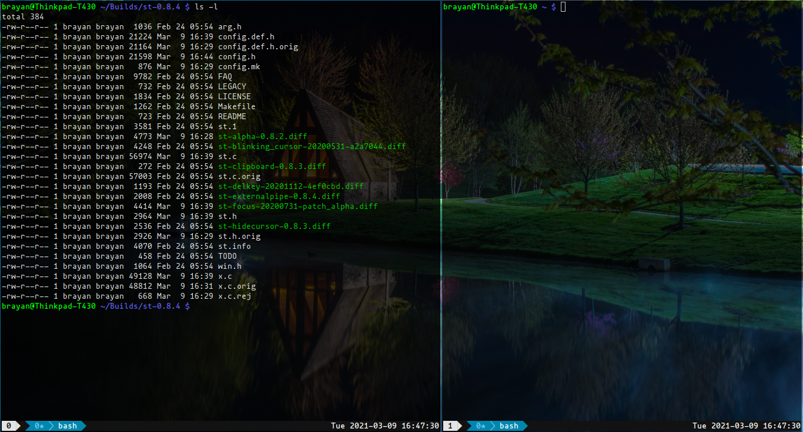

**st - simple terminal**
--------------------
st is a simple terminal emulator for X which sucks less.

**Features**
```
1. This config allow you make scroll with Shift + Page Up/Down key combination.
2. Also, you can do scroll with the mouse.
3. You can paste the latest content saved into your clipboard with mouse's right click.
```

**Requirements**
------------
In order to build st you need the Xlib header files.


**Installation**
------------
Edit config.mk to match your local setup (st is installed into
the /usr/local namespace by default).

Afterwards enter the following command to build and install st:

```
for i in $(ls -1 patches/); do patch -i patches/$i; done
make clean install
```

**Running st**
----------
If you did not install st with make clean install, you must compile
the st terminfo entry with the following command:

    tic -sx st.info

See the man page for additional details.

**Credits**
-------
Based on Aurélien APTEL <aurelien dot aptel at gmail dot com> bt source code.

**Some screenshots**

